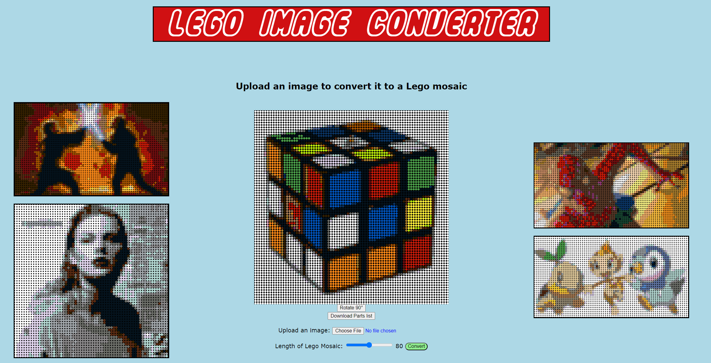

# Image To Lego Converter (Lego Mosaic Creator)

This converter allows users to input an image and returns a LEGO mosaic of that picture! It also allows the user to download a spreadsheet of all the pieces needed to build the mosaic in real life. 

This is an example of what a user would see when using the website:

## Usage

Visit [this website](image-to-lego.vercel.app) and submit any image you'd like to convert. The website will then show you a LEGO mosaic of your image and you can download the spreadsheet of parts if you'd like to build it in real life!